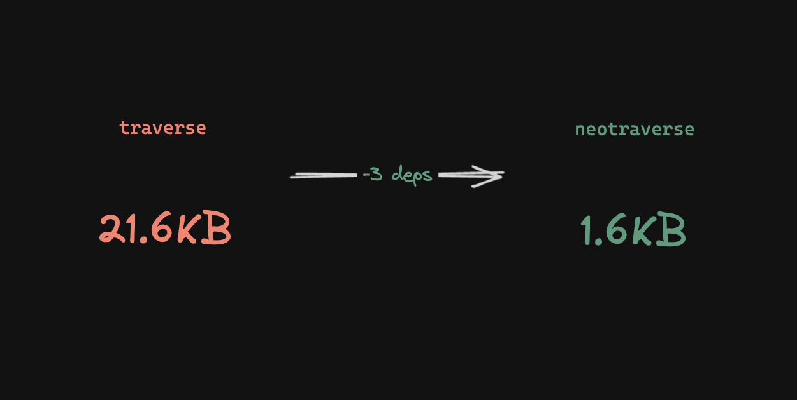
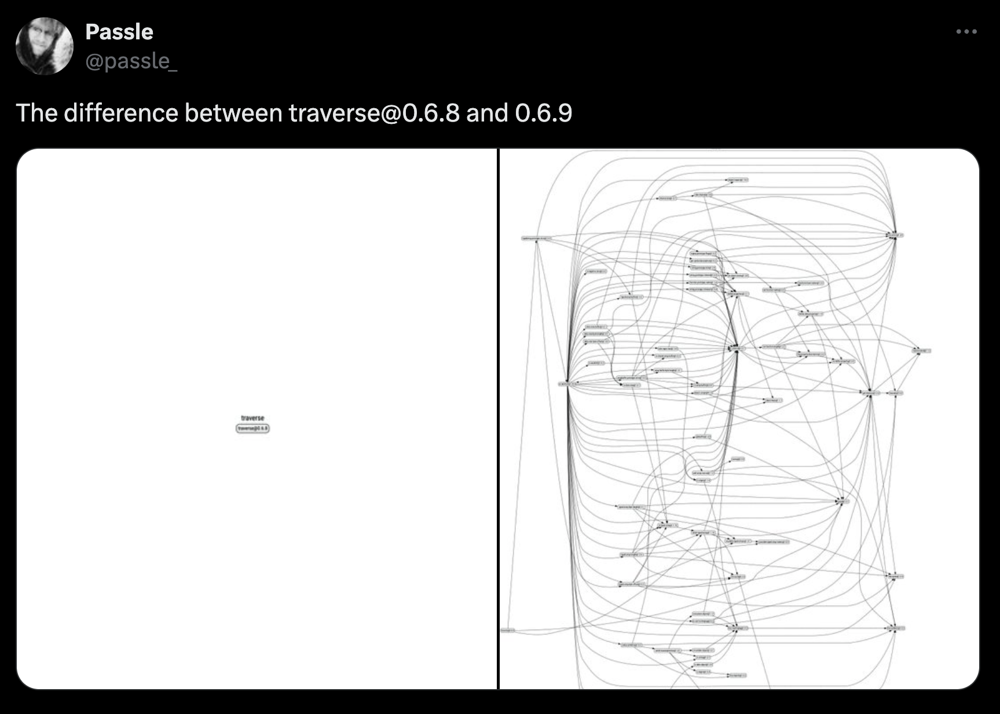

NPM: [npmjs.com/package/neotraverse](https://www.npmjs.com/package/neotraverse)

GITHUB: [github.com/puruvj/neotraverse](https://github.com/puruvj/neotraverse)

You might have heard of [traverse](https://github.com/ljharb/js-traverse). It's a package that allows you to traverse an object and execute a callback function on each property. It is quite a famous package, with over 8.5MILLION downloads per **week**. Uff thats a lot of downloads.

Recently, the author who took over the package released a patch update(0.6.8 -> 0.6.9), which increased its bundle size from `1.5KB` to a whopping `18KB`. All in a single patch update. How did that even happen? I'll explain in this post.

Until 0.6.8, traverse had no dependencies. It was a simple package with a single file. It was owned by a user named `James Halliday`, also known as `substack`. He recently deleted his entire github account around 0.6.7(Or so I've been told). It went to the new author, and he added some needed features to 0.6.8. However, 0.6.9 added 3 dependencies. Just 3. It may not seem a lot, but there's an insane entanglement of dependencies in this package, which is enough to make someone quit webdev entirely. Here it is:



> Source: [@passle\_](https://x.com/passle_/status/1810805530706792930)

First graph is 0.6.8, second is 0.6.9. Just look at that graph, its scary. And what's messed up more, is that some dependencies are included multiple times. Let's take a dependency A. it links to B, C, D. Now, B links to E, F, G. But, F links back to A now. F which is a transitive dependency of A, links back to A, it requires A. What the hell!! That's called a circular dependency. It's not necessarily a bad thing, but here it's happening multiple times, and because of the nature of publishing, it might be possible that your node modules are actually ending up with multiple version of the same dependency, which itself has dependency on the same things, and the cycle continues. Downloading this package one time causes 100s of downloads. 1 package causing 100s of downloads. It's freaking insane.

# Deeper issue

Go to [index.js](https://github.com/ljharb/js-traverse/blob/0f1e6f126a3d847864d3a80fc8227a2bb1f97c78/index.js), hit `CMD + F` and search for `TODO:`. What you will see will scare you.

The comments are scattered through, so I'll just copy and consolidate all the lines here for you to see:

```txt
// TODO: use call-bind, is-date, is-regex, is-string, is-boolean-object, is-number-object
// TODO: use isarray
// TODO: use for-each?
// TODO: use object-keys
// TODO: use reflect.ownkeys and filter out non-enumerables
// TODO: use object.hasown
```

6 comments, and 11 dependencies mentioned. 11. Means the author already had planned to inject more of his dependencies. And yes, a simple search will tell you that the current author is the author of all these libraries as well.

This stuff makes feel unsettled. As a web developer and npm publisher with more than 100,000 downloads per month, I'm not sure if I should be doing this. **No one** should be doing this. I strive to keep my packages as small as possible, and aggressively aim to have zero dependencies. And these comments signify that this package isn't getting any lighter.

So I decided to take things into my own hands.

# neotraverse

Introducing [neotraverse](https://github.com/puruvj/neotraverse), a fork of traverse.

- Zero dependencies
- 1.54KB min+brotli
- Built-in types. Say bye to @types/traverse
- ESM-first
- Legacy mode for drop-in replacement
- Aggressively modern

## Installation

```sh
npm install neotraverse
```

## Usage

```js
import { Traverse } from 'neotraverse';

const obj = {
  a: 1,
  b: 2,
  c: {
    d: 3,
    e: 4,
    f: {
      g: 5,
      h: 6,
      i: {
        j: 7,
        k: 8,
      },
    },
  },
};

new Traverse(obj).forEach(function (value) {
  console.log(value);
});
// Output: 1, 2, 3, 4, 5, 6, 7, 8
```

API is identical to what it was before, except traverse is a class now: `new Traverse(obj)`.

## Legacy mode

If you have too many instances of `traverse` in your codebase or you're running on an older version of NodeJS without ESM support, you can use the legacy mode.

ESM:

```js
import traverse from 'neotraverse/legacy';
```

CommonJS:

```js
const traverse = require('neotraverse/legacy');

const obj = {
  a: 1,
  b: 2,
  c: {
    d: 3,
    e: 4,
    f: {
      g: 5,
      h: 6,
      i: {
        j: 7,
        k: 8,
      },
    },
  },
};

traverse(obj).forEach(function (value) {
  console.log(value);
});

// identical to the above
traverse.forEach(obj, function (value) {
  console.log(value);
});

// Output: 1, 2, 3, 4, 5, 6, 7, 8
```

# Behind the scenes

There are some internal tooling changes:

- Fully TypeScript. That includes source code and tests
- pnpm instead of npm.
- Vitest instead of tape(Which also is the current author's package 😅)
- tsup. No build step before, now it's needed for typescript and multiple targets.
- Remove eslint. Not a fan of linters, but that's for another day.

## Attempt 1: Blindly converting to TypeScript

I tried converting the code to TypeScript, but there was a big flaw in this plan: non-typescript files don't usually adhere to strict structures, which means typescript will just throw errors. So naturally, I used my judgement to replace non-working code with working TS code. Problem is, the tests weren't passing afterwards.

Your own assumptions aren't always right.

## Attempt 2: Test-driven development

I don't write many tests, but in this case, the existing test suite helped a lot.

After the first attempt had failed, I went with a bottom-up approach. I converted all the tests over to Vitest, and removed all the new TypeScript code in favor of the same old JS code. This made the entire file go red with TypeScript errors, but that was irrelevant at that time.

Then i ran `vitest`. The nice thing about it is that it runs in watch mode by default. Which means, everytime I change my source file, it runs all the tests again, and it takes less than 1second to run all the tests. It was literally **Test driven development**.

### Targeting the dependencies

The 3 dependencies responsible for the entire havoc in the first place: `gopd`, `typedarray.prototype.slice`, `which-typed-array`.

I deleted them all and replaced them with their native equivalents.

- gopd -> `Object.getOwnPropertyDescriptors`
- typedarray.prototype.slice -> `TypedArray.prototype.slice`
- which-typed-array -> `ArrayBuffer.isView(value) && !(value instanceof DataView);`

> which-typed-array doesn't have a direct equivalent in new code because it was ultimately used to check if an object was a TypedArray, the type of the array wasn't used at all

After this I noticed some tests were failing, so I tweaked the implementations here and there until they were fixed.

### Aggressively typescript

Now I started to work on types. I added in types, started getting rid of legacy checks until most of the file was properly typed. This didn't cause any test failures thankfully.

### function constructor to Class

The code for `traverse` function was a class but in pre-es2015 style, which is not even a class:

```ts
function Traverse(obj) {
  // OMITTED FOR BREVITY
}

Traverse.prototype.get = function (ps) {
  // OMITTED FOR BREVITY
};

Traverse.prototype.has = function (ps) {
  // OMITTED FOR BREVITY
};
```

I took this opportunity to rewrite the codebase to ES2015 style, which is a class:

```js
export class Traverse {
  constructor(obj) {
    //  OMITTED FOR BREVITY
  }

  get(ps) {
    //  OMITTED FOR BREVITY
  }

  has(ps) {
    // OMITTED FOR BREVITY
  }
}
```

Top it off, I also provide `traverse`(a function which is a wrapper around the class) as the default export, so you can use it as a drop-in replacement.

```js
function traverse(obj, options) {
  return new Traverse(obj, options);
}
```

And ofc, traverse also supports methods on function constructors, so you can do this:

```js
const traverse = require('neotraverse');

traverse.forEach(obj, function (value) {
  console.log(value);
});
```

Enabling this was simple:

```js
const traverse = (obj: any, options?: TraverseOptions): Traverse => {
  return new Traverse(obj, options);
};

traverse.get = (obj: any, paths: PropertyKey[], options?: TraverseOptions): any => {
  return new Traverse(obj, options).get(paths);
};

traverse.set = (obj: any, path: string[], value: any, options?: TraverseOptions): any => {
  return new Traverse(obj, options).set(path, value);
};

traverse.has = (obj: any, paths: string[], options?: TraverseOptions): boolean => {
  return new Traverse(obj, options).has(paths);
};

traverse.map = (
  obj: any,
  cb: (this: TraverseContext, v: any) => void,
  options?: TraverseOptions,
): any => {
  return new Traverse(obj, options).map(cb);
};
```

As you can see, each method initializes the class again, which is a huge overhead, but for compatibility, it's is supported. Avoid using it if you can.

This is a huge change, but it's worth it.

## Backwards compatibility

This library will provide a direct legacy mode, which is CJS, and ES5 syntax, so it supports a lot of the older environments as well old Node versions.

For this I have a legacy.cts file which exports only `traverse` function, and nothing else. Not even the types.

```js
const traverse = require('./index.ts');
module.exports = traverse.default;
```

All the compilation of new features into old ones is done internally by `@swc/core`, which is a very fast compiler. Luckily its all built-in into [tsup](https://github.com/egoist/tsup), which is the build tool I use for every single package I publish and cannot recommend it enough.

# Conclusion

This package will **always** be compatible with the latest version of `traverse`. Period. There are multiple packages already that do the same, but folks who still use it would prefer to not change their codebase. And I respect that.

If you or your company intentionally use `traverse`, I urge you to migrate to this package. We've seen the author's intention to bloat this up more and more, whereas I promise that `neotraverse` will forever be a 0 dependency modern yet backward compatible package.

Lastly, I **intentionally** did not keep my `FUNDING.yml` file in this repo, which is the first thing previous author did when he took over `traverse`, so if you want to support me, the link is: [Github Sponsors](https://github.com/sponsors/puruvj)

Peace ✌️
