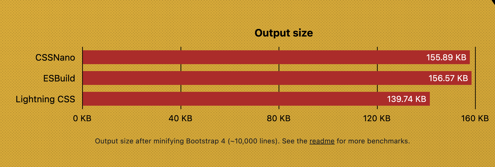

_Vite is an awesome, awesome tool for minification and bundling. It's fast, it's easy to use, and it's got a great community. But, it's not the only tool out there. There are other tools like Rollup, ESBuild, and more. And, they all have their own advantages and disadvantages. But, they all have one thing in common: they don't have a LighteningCSS plugin._

What you read above is generated by Github Copilot. I can rest assure you that rest of the article is written by a human, and you're reading a person's authentic thoughts. This disclaimer is presented to you in recent light of tools like ChatGPT popping up, and people being confused about whether or not the text they're reading is generated by a machine or a human. So be rest assured, this article is 1000% written by a human.

So, with that out of the way, let's get into the article.

# The problem: Processing CSS is hard

What I mean by processing: Bundling CSS using bundlers like Rollup, ESBuild, Vite etc, and it includes SASS/LESS/SCSS transpiling, CSS Modules, Code Splitting, Minification etc. Most of these problems right now are solved literally in Vite's core code.

Yes, Vite is the best CSS processor of any bundler I have seen until now. It has so many goodies:

- `@import` Inlining and Rebasing
- PostCSS
- CSS Modules
- CSS Pre-processors (SASS/SCSS, LESS, STYLUS)
- Minification
- Inlining

The last feature(Inlining) is not specific to CSS, but to Vite. But, this feature is what lead to my research into CSS processing for rollup. More on that later.

## A missing piece

Vite's CSS processing is really good. However, it can be better: At the time of writing, Vite is using ESBuild for minification and some of the CSS processing, combined with PostCSS. ESBuild is a great tool, but it's not the best tool for minification. It's not the best tool for CSS processing either. And, that's where LighteningCSS comes in.

## LighteningCSS

[LighteningCSS](https://lightningcss.dev/) is _"an extremely fast CSS parser, transformer, bundler, and minifier."_ It's completely written in Rust, so off course, it's **very** fast. But that's not all. It's also the best minifier I have seen in the wild. It's minification is more efficient than other alternatives like `cssnano`, as listed on their website 👇



Only issue you could say: It doesn't have preprocessors built in, but I think it's fine. All the preprocessors are changing rapidly, and one tool having to keep up with them is a huge undertaking. We can do preprocessing as a separate step.

# The original problem: CSS for Rollup

Now, how did I come up for this idea? Well, I was working on a project, [neoconfetti](https://github.com/PuruVJ/neoconfetti), where I wanted to embed my **CSS Modules**, minify the resulting CSS, and **inline** it in the JS file. The CSS is very tiny, so it would be fine embedding it right in the JS. This is the CSS 👇

```css
@keyframes y-axis {
  to {
    transform: translate3d(0, var(--stage-height), 0);
  }
}

@keyframes x-axis {
  to {
    transform: translate3d(var(--x-landing-point), 0, 0);
  }
}

@keyframes rotation {
  50% {
    transform: rotate3d(var(--half-rotation), 180deg);
  }
  100% {
    transform: rotate3d(var(--rotation), 360deg);
  }
}

.container {
  width: 0;
  height: 0;

  overflow: visible;

  position: relative;

  z-index: 1200;
}

.particle {
  animation: x-axis var(--duration-chaos) forwards cubic-bezier(
      var(--x1),
      var(--x2),
      var(--x3),
      var(--x4)
    );
  animation-name: x-axis;
}

.particle > div {
  position: absolute;
  top: 0;
  left: 0;

  animation: y-axis var(--duration-chaos) forwards cubic-bezier(
      var(--y1),
      var(--y2),
      var(--y3),
      var(--y4)
    );
  animation-name: y-axis;

  width: var(--width);
  height: var(--height);
}

.particle > div::before {
  display: block;

  height: 100%;
  width: 100%;

  content: '';
  background-color: var(--bgcolor);

  animation: rotation var(--rotation-duration) infinite linear;
  animation-name: rotation;

  border-radius: var(--border-radius);
}
```

And then, in my code, I wanted to get the CSS Modules Map from this, to apply to different elements. In case you're not aware of CSS Modules, this is how they work:

## CSS Modules 101

You write your CSS with classes, like usual:

```css
.container {
  width: 0;
  height: 0;

  overflow: visible;

  position: relative;

  z-index: 1200;
}
```

And then in your code, you import your CSS file with a default import(`import css from './hello.module.css`). And refer the class as property of a JS object in your code. Like this:

```js
import css from './hello.module.css';

const element = document.querySelector('.container');
element.classList.add(css.container);
```

Why can't you just `classList.add('.container')`? Because CSS modules will mangle the name of the resulting class, so your CSS turns into something like this:

```css
._container_1e4f {
  width: 0;
  height: 0;

  overflow: visible;

  position: relative;

  z-index: 1200;
}
```

See how the class name was mangled? `.container` -> `._container_1e4f`. Now you can have as many `.container` in your different Stylesheets, and they won't conflict with each other. This is how CSS Modules work.

And on the JS side, the `css` identifier, which you used to reference the `.container` class, is turned into an object which looks like this:

```js
export default {
  container: '_container_1e4f',
};
```

---

Now getting back to the problem.

So, I need the following to be done for my library:

- Process CSS Modules
- Minify the CSS
- Expose it to the JS(as string, as well as a JS map name)
